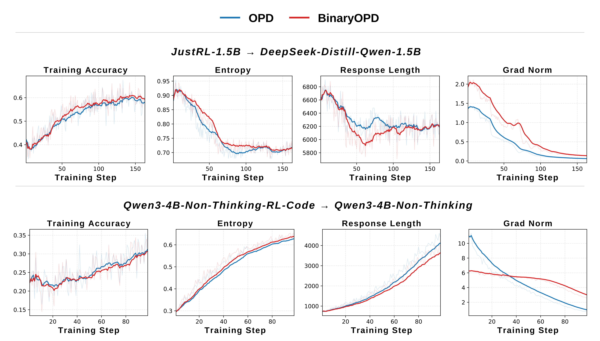
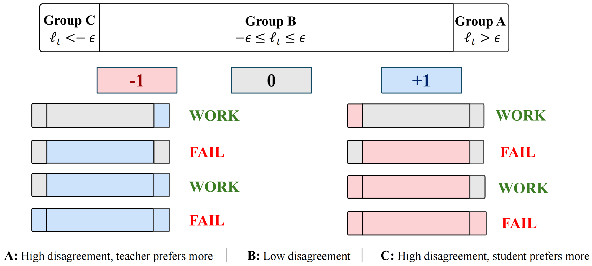

<div align="center">


# Do We Really Need KL Divergence for On-Policy Distillation of Large Language Models?

</div>

## 📖 Overview

### 1. BinaryOPD: Direction Is Sufficient

On-policy distillation (OPD) rewards student-generated tokens with the teacher–student log-ratio:

$$
R_{\text{OPD}}(o_t)=\log\frac{\pi_T(o_t\mid q,o_{\lt t})}{\pi_\theta(o_t\mid q,o_{\lt t})}.
$$

**BinaryOPD** replaces this with a binary directional reward:

$$
r_t=
\begin{cases}
+1, & \text{if } \pi_T(o_t\mid q,o_{\lt t})>\pi_\theta(o_t\mid q,o_{\lt t}),\\
-1, & \text{if } \pi_T(o_t\mid q,o_{\lt t})\lt \pi_\theta(o_t\mid q,o_{\lt t}).
\end{cases}
$$

Equal probabilities receive zero reward. This simple directional feedback achieves performance comparable to OPD with reverse KL.

<p align="center">
  
</p>

### 2. Only the Direction of High-Disagreement Tokens Is Critical

Our positive and negative experiments show that the update direction of high-disagreement tokens is critical. Let $x_t=\log(p_T/p_s)$ and partition tokens into:

$$
A=\lbrace t:x_t>\epsilon\rbrace,\qquad
B=\lbrace t:-\epsilon\le x_t\le\epsilon\rbrace,\qquad
C=\lbrace t:x_t\lt -\epsilon\rbrace.
$$

The **positive experiment** assigns **+1 to every selected token**; the **negative experiment** assigns **-1 to every selected token**. Unselected tokens receive zero:

$$
r_t^{(+)}=\begin{cases}
+1, & t\in S,\\
0, & t\notin S,
\end{cases}
\qquad
r_t^{(-)}=\begin{cases}
-1, & t\in S,\\
0, & t\notin S.
\end{cases}
$$

<p align="center">
  
</p>

**The critical signal is the direction of a small subset of high-disagreement tokens.** In the Qwen3-4B positive experiment, Group A contains less than 1.5% of tokens yet retains OPD performance. 

The two scripts default to A-only (+1) and C-only (-1). Change `LOWER_BOUND` and `UPPER_BOUND` to run the other selections.

### 3. C-MOPD: Learning from Multiple Teachers Simultaneously

**Consensus Multi-Teacher On-Policy Distillation (C-MOPD)** applies the finding above: mild disagreement need not block an update, but strong opposing feedback should. Let $p_s$ be the student probability, $p_k$ the probability from teacher $k$, $d$ the domain teacher, and $x_k=\log(p_k/p_s)$:

$$
R_{\text{C-MOPD}}=
\begin{cases}
+1, & p_k>p_s\quad\forall k,\\
-1, & p_k\lt p_s\quad\forall k,\\
+1, & \text{teachers conflict},\ p_d>p_s,\ x_k>-\epsilon\quad\forall k\ne d,\\
-1, & \text{teachers conflict},\ p_d\lt p_s,\ x_k\lt \epsilon\quad\forall k\ne d,\\
0, & \text{otherwise}.
\end{cases}
$$

Unlike MOPD, which routes each sample to one teacher, C-MOPD lets all teachers supervise every sample.

## 🤗 Models and Data

### Teacher–student pairs

| Task | Student                                                                                           | Teacher                                                                                                                         | Training data |
| ------| ---------------------------------------------------------------------------------------------------| ---------------------------------------------------------------------------------------------------------------------------------| ---------------|
| Math | [DeepSeek-R1-Distill-Qwen-1.5B](https://huggingface.co/deepseek-ai/DeepSeek-R1-Distill-Qwen-1.5B) | [JustRL-DeepSeek-1.5B](https://huggingface.co/hbx/JustRL-DeepSeek-1.5B)                                                         | DAPO-Math-17k |
| Math | [Qwen3-1.7B-Base](https://huggingface.co/Qwen/Qwen3-1.7B-Base)                                    | [Qwen3-4B-Base-RL](https://huggingface.co/LemonTea03/Qwen3-4B-Base-RL)                                                          | DAPO-Math-17k |
| Math | [Llama-3.2-3B-Instruct](https://huggingface.co/meta-llama/Llama-3.2-3B-Instruct)                  | [GT-Llama-3.2-3B-Instruct-MATH](https://huggingface.co/TMLR-Group-HF/GT-Llama-3.2-3B-Instruct-MATH)                             | DeepMath      |
| Math | [Qwen3-4B-Non-Thinking](https://huggingface.co/Qwen/Qwen3-4B)                                    | [Qwen3-4B-Non-Thinking-RL-Math](https://huggingface.co/Keven16/Qwen3-4B-Non-Thinking-RL-Math-Step500)                                        | DeepMath      |
| Math | [Qwen3-30B-A3B-Non-Thinking](https://huggingface.co/Qwen/Qwen3-30B-A3B)                 | [Qwen3-30B-A3B-Instruct-2507](https://huggingface.co/Qwen/Qwen3-30B-A3B-Instruct-2507)                                          | DeepMath      |
| Code | [Qwen3-4B-Non-Thinking](https://huggingface.co/Qwen/Qwen3-4B)                      | [Qwen3-4B-Non-Thinking-RL-Code](https://huggingface.co/Keven16/Qwen3-4B-Non-Thinking-RL-Code-Step300)                                        | Eurus         |
| Code | [DeepSeek-R1-Distill-Qwen-1.5B](https://huggingface.co/deepseek-ai/DeepSeek-R1-Distill-Qwen-1.5B) | [Nemotron-Research-Reasoning-Qwen-1.5B](https://huggingface.co/nvidia/Nemotron-Research-Reasoning-Qwen-1.5B) | Eurus         |


### Datasets

All prepared training and evaluation data: **[LemonTea03/BinaryOPD-Data](https://huggingface.co/datasets/LemonTea03/BinaryOPD-Data/tree/main)**.

| Split    | File                                    | Content                                                        |
| ----------| -----------------------------------------| ----------------------------------------------------------------|
| `train/` | `DAPO-Math-17k.parquet`                 | DAPO math training set                                         |
| `train/` | `DeepMath-103K-filtered-level6.parquet` | DeepMath, difficulty >= 6                                      |
| `train/` | `Eurus-RL-Data-code.parquet`            | Eurus code training set                                        |
| `train/` | `math_and_code.parquet`                 | Balanced DeepMath + Eurus mixture for MOPD/C-MOPD              |
| `eval/`  | `math_eval.parquet`                     | AIME24/25, AMC, MATH500, Minerva, OlympiadBench, and IMO-Bench |
| `eval/`  | `livecodebench_v6.parquet`              | LiveCodeBench v6 evaluation slice                              |
| `eval/`  | `HumanEval.parquet`                     | HumanEval                                                      |
| `eval/`  | `MBPP.parquet`                          | MBPP                                                           |


## 🔧 Implementation and Switches

| Component | File |
| --- | --- |
| BinaryOPD reward | `verl/verl/trainer/ppo/core_algos.py` → `compute_binary_opd_reward` |
| Positive / negative rewards | `verl/verl/trainer/ppo/core_algos.py` → `compute_constant_opd_reward` |
| Reward integration | `verl/verl/trainer/ppo/ray_trainer.py` → `binary_opd` / `constant_reward` |
| Multi-teacher routing / consensus | `verl/verl/workers/mopd_routing.py` |

| Switch                                                                        | Meaning                                                                       |
| ----------------------------------------------------------------------------- | ----------------------------------------------------------------------------- |
| `actor_rollout_ref.rollout.binary_opd`                                        | Enable BinaryOPD's directional rewards, without interval filtering            |
| `actor_rollout_ref.rollout.constant_reward`                                   | `0`: disabled; `1`: fixed +1; `-1`: fixed -1 inside the selected interval     |
| `actor_rollout_ref.rollout.reward_lower_bound` / `reward_upper_bound`         | Inclusive interval for constant rewards; schema defaults `-inf` / `inf`       |
| `reward_model.multi_teacher_mode`                                             | `routing`: MOPD; `consensus`: C-MOPD                                          |
| `reward_model.consensus_epsilon`                                              | Consensus tolerance for C-MOPD; default `0.8`                                 |


## 🚀 Getting Started

### Environment

```bash
conda create -n verl python=3.12
conda activate verl
cd verl
bash scripts/install_vllm_sglang_mcore.sh
pip install --no-deps -e .
cd ..
```

### Train

Set model and data paths at the top of each standalone script, or override them through environment variables. For example, with the flat Hugging Face dataset layout:

```bash
export DATA_ROOT=/path/to/BinaryOPD-Data
export ACTOR_MODEL_PATH=/path/to/student
export TEACHER_MODEL_PATH=/path/to/teacher
export TRAIN_DATASET="$DATA_ROOT/train/DeepMath-103K-filtered-level6.parquet"
export EVAL_DATASETS_COLON="$DATA_ROOT/eval/math_eval.parquet"

bash BinaryOPD.sh                 # BinaryOPD
bash opd_baseline.sh              # OPD baseline
bash positive_experiment.sh       # Positive experiment
bash negative_experiment.sh       # Negative experiment
```


**Positive and negative experiments.** 

| Script | Selected groups | `LOWER_BOUND` | `UPPER_BOUND` | Kept-token reward |
| --- | --- | --- | --- | --- |
| `positive_experiment.sh` | A (default) | `0.8` | `inf` | +1 |
| `positive_experiment.sh` | B | `-0.8` | `0.8` | +1 |
| `positive_experiment.sh` | A+B | `-0.8` | `inf` | +1 |
| `positive_experiment.sh` | A+B+C | `-inf` | `inf` | +1 |
| `negative_experiment.sh` | C (default) | `-inf` | `-0.8` | -1 |
| `negative_experiment.sh` | B | `-0.8` | `0.8` | -1 |
| `negative_experiment.sh` | B+C | `-inf` | `0.8` | -1 |
| `negative_experiment.sh` | A+B+C | `-inf` | `inf` | -1 |

For example:

```bash
LOWER_BOUND=-0.8 UPPER_BOUND=inf EXPERIMENT_NAME=positive-AB-eps0.8 \
  bash positive_experiment.sh
LOWER_BOUND=-inf UPPER_BOUND=0.8 EXPERIMENT_NAME=negative-BC-eps0.8 \
  bash negative_experiment.sh
```

Replace 0.8 with 0.2 or 0.5 for the other thresholds.

For the multi-teacher experiments:

```bash
export ACTOR_MODEL_PATH=/path/to/Qwen3-4B
export MATH_TEACHER_PATH=/path/to/Qwen3-4B-Non-Thinking-RL-Math-Step500
export CODE_TEACHER_PATH=/path/to/Qwen3-4B-Non-Thinking-RL-Code-Step300
export TRAIN_DATASET="$DATA_ROOT/train/math_and_code.parquet"
export EVAL_DATASETS_COLON="$DATA_ROOT/eval/math_eval.parquet:$DATA_ROOT/eval/livecodebench_v6.parquet:$DATA_ROOT/eval/HumanEval.parquet:$DATA_ROOT/eval/MBPP.parquet"

bash mopd_baseline.sh
CONSENSUS_EPSILON=0.8 EXPERIMENT_NAME=C-MOPD-eps0.8 \
  bash C-MOPD.sh
```


### Evaluate

```bash
CKPT_PATH=/path/to/hf_model_or/global_step_N \
EVAL_DATASETS_COLON="$DATA_ROOT/eval/math_eval.parquet:$DATA_ROOT/eval/livecodebench_v6.parquet:$DATA_ROOT/eval/HumanEval.parquet:$DATA_ROOT/eval/MBPP.parquet" \
EXPERIMENT_NAME=my-model-avg8 \
EVAL_N_SAMPLES=8 EVAL_MAX_RESPONSE_LENGTH=16384 EVAL_TEMPERATURE=0.7 \
EVAL_VAL_BATCH_SIZE=8 EVAL_GPU_MEMORY_UTILIZATION=0.7 \
bash eval.sh
```


## Acknowledgments

- [OPD](https://github.com/Thinking-Space/Rethinking-OPD) — the on-policy distillation implementation this repository builds on.
- [verl](https://github.com/verl-project/verl) — the underlying training framework.
